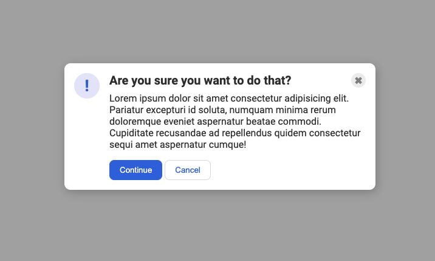

# A common 'modal' style
This one is another very common pattern on the web. The solution to this one is _simple_... but it might not be immediately obvious to you. You'll need to edit the HTML a bit to get everything where it needs to be.

### A hint
Depending on how you approach this one, you might need to revisit the `flex-shrink` property to keep a flex item from getting smashed.

## Desired outcome

### Self Check

X The blue icon is aligned to the left.
  Note: this was set aside in it's own div when I got it working
X There is equal space on either side of the icon (the gaps between the icon and the edge of the card, and the icon and the text, are the same)

X There is padding around the edge of the modal.

- The header, text, and buttons are aligned with each other.
  Note: this req'd an edit to the html layout. boxing out the icon was checked off earlier right away, so for this check it meant making sure the new box wrapped around text and buttons.
X The header is bold and a slightly larger text-size than the text.
  Note: I wanted this to be an h3 so bad. Alas - we're really laying into the divs for these examples
X The close button is vertically aligned with the header, and aligned in the top-right of the card.
  Note: in other words: make sure that you've boxed-in the close button within the .header
